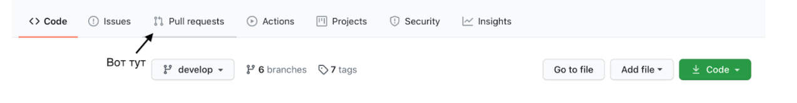
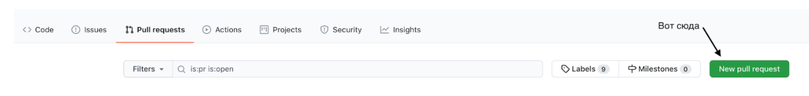
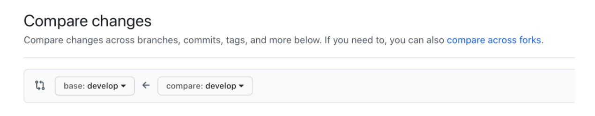

## Pull requests' guideline

**Мы переходим на сдачу домашних заданий через Pull request, начиная с курса IOSINT (Промышленная разработка).**

**Pull Request** — это запрос на вливание изменений из вашей ветки в основную ветку исходного репозитория.

#### Для чего нужен Pull Request?
* Когда вы начнете работать в командах над каким-либо продуктом, чаще всего все новые функциональности в приложении будут попадать в него только после проверки вашего кода другими членами команды (code review).
* Это дисциплинирует писать хороший код, а главное - просматривать и редактировать плохие решения самому. Когда вы разрабатываете какую-то функциональность в приложении, вы не всегда можете заметить недочеты, тогда как в пулл реквесте можно просмотреть весь написанный код и если вам что-то не понравится в нем, то сможете внести правки до того, как эта функциональность попадет в основную ветку.

#### Git Flow

Чтобы научиться правильно пользоваться инструментом Pull request, нужно освоить git flow. **Git Flow** — методология работы с Git, то есть в ней определяется, какие виды веток необходимы проекту и как выполнять слияние между ними. 

* Работа по git flow заключается в разделении веток на master, develop, features, hotfix и тд. 
* В ветке master (или main) всегда хранятся только протестированные, готовые к релизу (или уже выложенные) версии программы. 
* В ветке develop хранятся промежуточные результаты разработки. 
* Ветки feature/… создаются для разработки новой функциональности. 
* В hotfix ветках делаются правки уже готовой функциональности. 

[Подробнее о ветвлениях](https://nvie.com/posts/a-successful-git-branching-model)

[Подробнее о git flow](https://danielkummer.github.io/git-flow-cheatsheet/index.ru_RU.html)

**Как это использовать для домашних заданий?**
Необходимо для каждого модуля создавать свой репозиторий. Например, работа с многопоточностью отдельный репозиторий, работа с сетью другой репозиторий и тд.

**Пошаговый алгоритм:**
1. Создание репозитория. Перейдите на `github` и создайте репозиторий с названием модуля, например, multithreading.
2. Склонируйте репозиторий к себе на компьютер.
3. Создайте ветку master (main), а затем от нее создайте ветку develop. Примечание: все следующие ветки будут создаваться от ветки develop. Делаете push каждой ветки.
4. От ветки develop создайте ветку с названием вашей домашней работы. Будем считать, что это функциональность вашей программы, поэтому к названию добавим feature. В итоге получится что-то типа ```feature/task-1/initial```. И также как раньше делайте push.
Примечание. Для вашего удобства просмотра и редактирования конечной работы каждое задание будем разделять на две ветки: 1 - initial, 2 - implementation (или сокращенно impl). Это делается для того, чтобы потом в пулл реквесте не было по 200 измененных файлов.
5. В ветку initial добавьте все файлы, которые в будущем понадобятся для выполнения домашнего задания (например, проект для дальнейшей реализации).
6. Сделайте commit’ы с изменениями.
7. Создаем от ветки initial ветку implementation, например, ```feature/task-1/implementation```
8. Выполните домашнее задание, сопровождая всю работу исчерпывающими commit’ами и делаете push изменений на github.
9. Перейдите на github, далее на вкладку Pull Requests. 


10. Выберите New Pull Request


11. Выберите ветки для создания запроса на pull. 
В поле compare выберите вашу ветку с реализацией, например, feature/task-1/implementation. 
В поле base выберите ветку, куда будете вливать свои изменения, в нашем случае это initial, например, feature/task-1/initial


12. Прокрутите страницу вниз и просмотрите свой код еще раз: он должен быть чистым, не должно быть закомментированного кода, съехавшего кода и лишних отступов. 
Если во время просмотра кода у вас появятся мысли по улучшению решения, то не спешите закрывать гит - вы можете внести изменения у себя в Xcode, сделать коммит и пуш, а затем обновить страницу на github.
13. После проверки кода нажмите Create Pull Request, запишите название, что и куда собираетесь влить. В комментарии можно добавить пояснение к работе (не обязательно). После этого снова нажмите Create Pull Request.
14. Далее скопируйте ссылку на pull request и отправьте ее во вложениях в домашней работе.


[Подробнее про работу Pull Requests](https://docs.github.com/en/free-pro-team@latest/github/collaborating-with-issues-and-pull-requests/about-pull-requests)

[Видеоинструкция по работе в терминале от аспиранта курса Алексея Бардина](https://youtu.be/o0RaC43uGPY)


